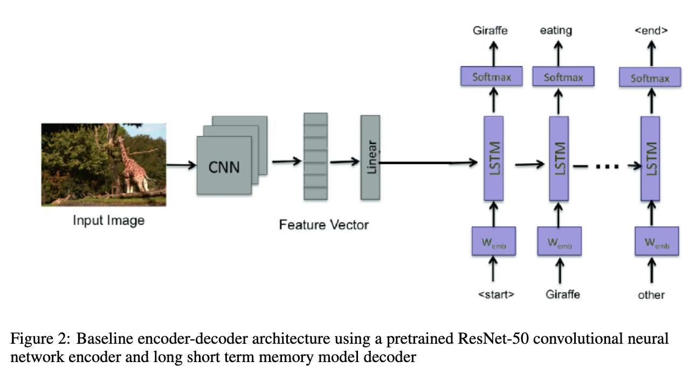
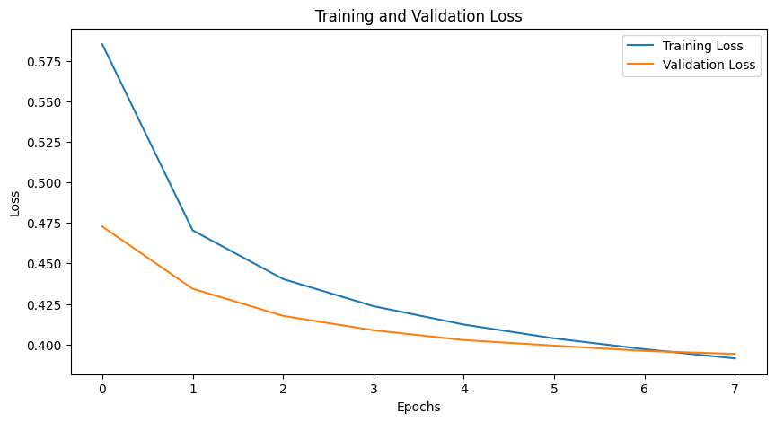

# Image-to-Text

Image Captioning using ResNet50 and LSTM in Pytorch

### Model

- ResNet50 - Extract image feature (pretrained) as encoder
- LSTM - Generate descripton of image from extracted feature as decoder
- BERT tokenizer - Tokenize the label and detokenize the LSTM perdiction (pretrained)

### Training

- Train on flickr30k dataset
- Train on GPU P100 on kaggle 
- Number of Epochs = 8

### Result

- Training loss = 0.3914
- Validation loss = 0.3942
- Average BLEU Score = 0.4112

### Deployement

- Built UI interface using Gradio  
- Deployed on Hugging Face Gradio spaces
